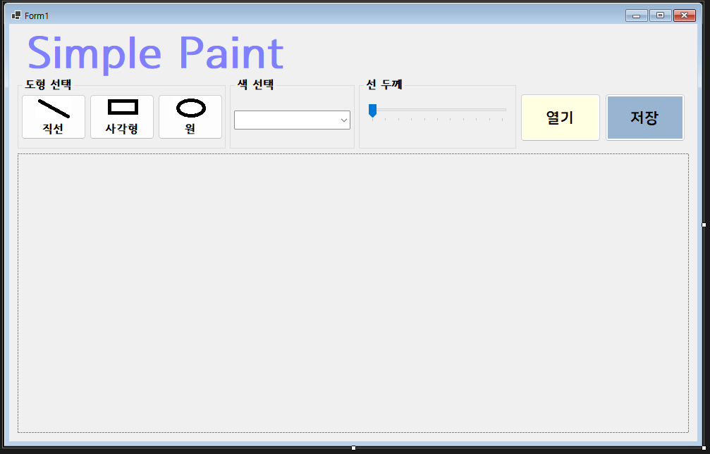
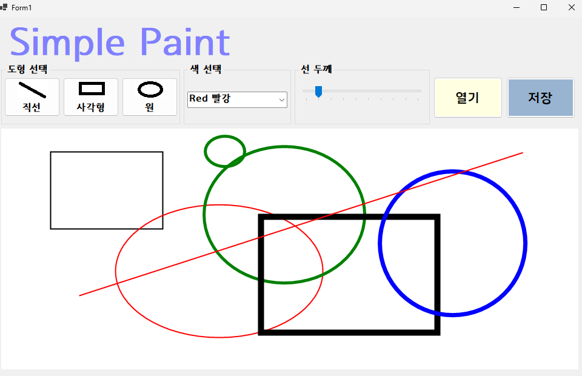
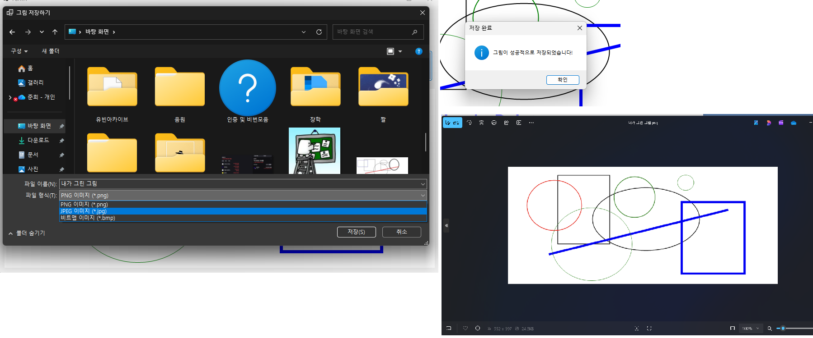
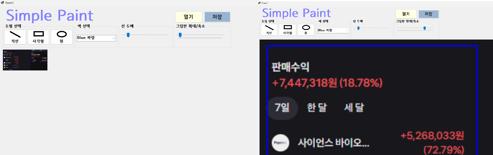

# (C# 코딩) Simple Paint

## 개요
- C# 프로그래밍 학습
- 1줄 소개: 빈 공간이나 사진을 불러와서 여러 가지 색상과 두께로 도형을 그려보자!
- 사용한 플랫폼:
  - C#, .NET Windows Forms, Visual Studio, GitHub
- 사용한 컨트롤:
  - Label, GroupBox, Button, PictureBox, TrackBar, ComboBox
- 사용한 기술과 구현한 기능:
  - Visual Studio를 이용하여 UI 디자인
  - case로 색상 선택, 파일 포맷 선택 등을 용이하게 함
  - 버튼 click 이벤트 연결로 도형 선택 및 이미지 저장,불러오기 기능 구현
  - groupbox로 효율적인 영역 묶기
  - picturebox로 사진 불러와서 그 위에 그림 그리기 가능
  - enum으로 도형 타입 추가
  - if문으로 그리기 상태 업데이트
  - SaveFileDialog로 파일 저장 기능 구현
  - 파일 저장 후 성공 알림을 Messagebox로 출력

## 실행 화면 (과제1)
- 과제1 코드의 실행 스크린샷

- 과제 내용
  - 기본 UI 배치 및 디자인
- 구현 내용과 기능 설명
  - Label, GroupBox, Button, PictureBox, TrackBar, ComboBox 조화롭게 배치함
  - Color, 폰트 적용 및 일부 Button 사진 디자인

## 실행 화면 (과제2)
- 과제2 코드의 실행 스크린샷

- 과제 내용
  - Button 메뉴에서 사각형, 원, 선 중 선택해 그리기 
  - ComboBox에서 색상 선택 
  - TrackBar로 두께 선택 
- 구현 내용과 기능 설명
  - MouseEvent를 사용해서 마우스 클릭, 클릭 떼기, 움직이기로 그리기 상태 업데이트
  - x, y, width, height 변수를 적용하여 도구를 switch할 때마다 각 case에서 필요한 변수만 가져와서 용이하게 그리게 함
  - 색상 선택 또한 인덱스 번호 case에 따라서 적용함
  - 두께는 currentLineWidth = trbLineWidth.Value; 코드처럼 작성하여 트랙바의 값에 비례해서 두껍게/얇게 되도록 함

## 실행 화면 (과제3)
- 과제3 코드의 실행 스크린샷

- 과제 내용
  - png, bmp, jpg 중 선택하여 그린 내용을 사진으로 저장할 수 있음
  - 저장 성공 시 저장 성공 메시지박스 띄움
- 구현 내용과 기능 설명
  - SaveFileDialog 기능으로 저장 팝업 열기
  - format의 case에 따라 압축 형태 설정
  - type 검사 후 저장 성공 시 MessageBox 출력

## 실행 화면 (과제4)
- 과제4 코드의 실행 스크린샷

- 과제 내용

- 구현 내용과 기능 설명
